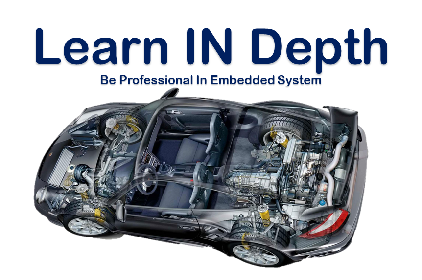

# Embedded Systems Online Diploma

---
## Contents

### First Term 

- [Unit 1: Diploma Prerequisites](https://github.comMohaned-Zara/Embedded_System) 
- [Unit 2: C Programming](Unit_2_C_Programming) 
- [Unit 3: Embedded C](Unit_3_Embedded_C) 
- [Unit 4: System Architect](Unit_4_System_Architecture)
- [Unit 5: First Term Projects](Unit_5_First_Term_Projects)

---
<!---
### Second Term

- [Unit 6: MCU Fundamentals](Unit_6_MCU_Fundamentals)
- [Unit 7: MCU Essential Peripherals](Unit_7_MCU_Essential_Peripherals)
- [Unit 8: MCU Interfacing](Unit_8_MCU_Interfacing)
- [Unit 9: MCU Timers/ADC](Unit_9_MCU_Timer_%26_ADC)
- [Unit 10: SW Testing/Validation](Unit_10_SW_Testing_Validation)
- [Unit 11: Apply on Embedded Systems Jobs](https://github.com/Mohaned-Zara/Embedded_System)

---

### Third Term

- [Unit 12: Advanced Topics](https://github.com/Mohaned-Zara/Embedded_System)
- [Unit 13: Automotive Protocols](https://github.com/Mohaned-Zara/Embedded_System)
- [Unit 15: RTOS Basics](https://github.com/Mohaned-Zara/Embedded_System)
- [Unit 16: AUTOSAR Basics](https://github.com/Mohaned-Zara/Embedded_System)
- [Unit 17: Embedded Linux Basics](https://github.com/Mohaned-Zara/Embedded_System)
---

## My Progress Profile:

---
-->
